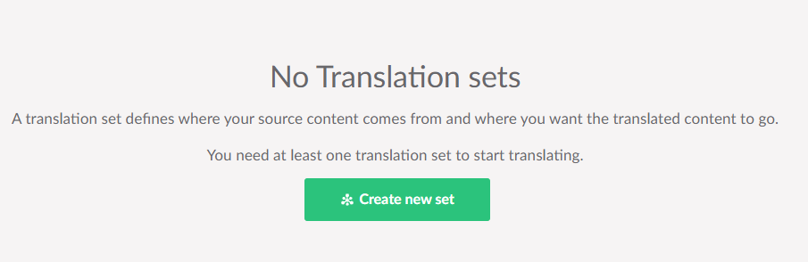

---
title: Configure Translations
--- 

Before you can perform any translations with Translation Manager you will need to configure it so it knows where your primary language content is and where you want the translated content to go. 

You do this by creating a [Translation Set.](../reference/fundementals/set)

## 1. Create a Translation Set: 

1. Go to the settings section of Umbraco
2. Expand the *Translation Manager* node in the settings tree
3. Go to the *Sets* node
4. Click on the *Create new set* button.


## 2. Configure Your Translation Set

 1. Give your set a name.
 2. Select your master content node.
    - This is the place where your source content is going to come from 
 3. Select the locations you want the translated content to go.

You can have multiple locations on for each language your want to translate.

 You don't need to change any other settings but you can follow our [create a Translation Set guide](../userGuide/create) for more info.

## Optional settings

A few features are switched on and off in the `Translation` section of your `appsettings.json` rather than in the backoffice:

```json
{
  "Translation": {
    "GlossaryEnabled": true,
    "MemoryEnabled": true
  }
}
```

| Setting | Default | What it does |
| --- | --- | --- |
| `GlossaryEnabled` | `false` | Shows the [Glossary](../userGuide/glossary) in the Translations section. A connector configured to use the glossary also switches it on, so you often don't need to set this by hand. |
| `MemoryEnabled` | `true` | Shows [Translation Memory](../userGuide/memory) and lets connectors read and write it. Turning it off leaves stored entries alone. |

