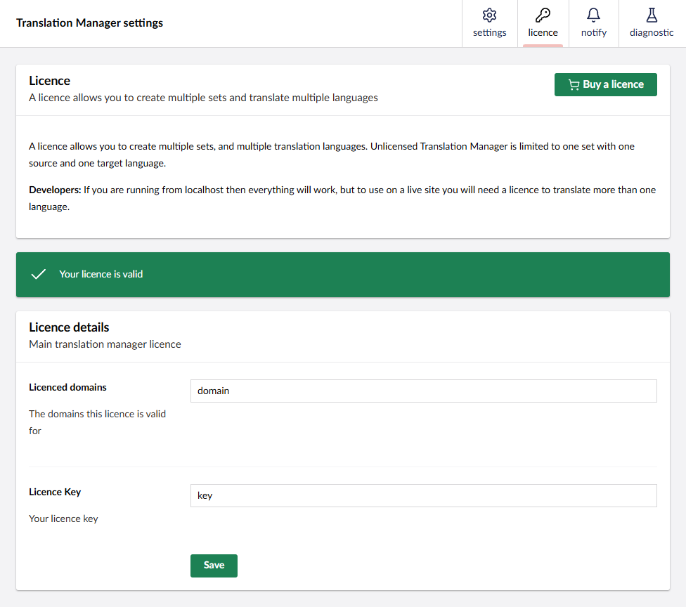

## Licence Limits
Without a licence you can have one [translation set](../reference/fundementals/set) and translate between two languages, such as from English to French, but you cannot add other languages. 

On your local machine, where the domain ends in either .localhost or .local, you can have as many languages or translation sets as you want. However, when you move to a production server, the licence limits will apply.

## Purchase a Licence

Go to the website https://jumoo.co.uk/translate/purchase


## Add Licence Key to the Site 


You can find the licence key box in the backoffice in Settings -> Translation Manager -> licence.

The licence is stored in `umbraco/Licence/translationManager.licence`. This file can be copied between servers.

You can also enter the licence key in config:

```json
"Translation": {
  "License" : {
        "Key": "[LICENCE-KEY]",
        "Domains": "[LICENCE-DOMAIN]"
    }
}
```
This way if the translationManager.licence file is deleted, your translation key won't go with it. 
