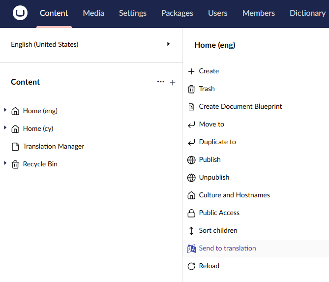
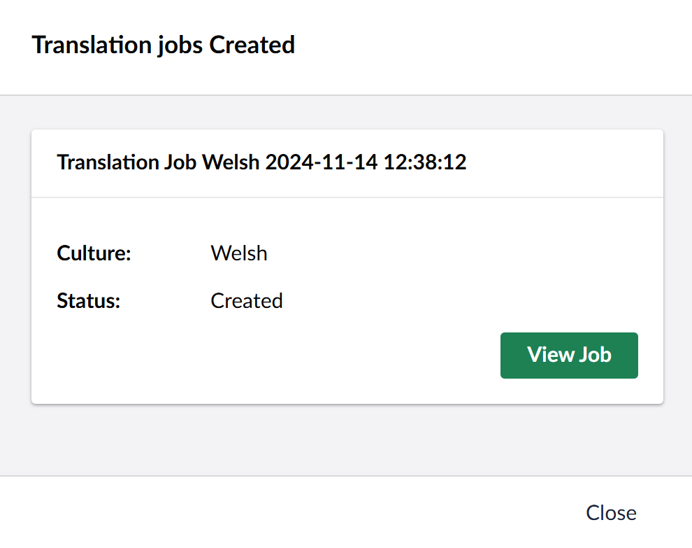

To send content for translation, first select the "Send to translate..." option from the menu. 

You will then see the send to translate dialog. As of Version 17.2 the [translation connector](../reference/fundementals/connector) options dialog is part of the send to translate dialog. 

:::tip 
Depending on the translation connectors you have installed you might see different options here.
:::

## Languages
- Select the languages you wish to translate using the checkboxes.

## Select Connector 
- Select your connector. If you already have a preset connector it will display here. 

## Include Children
  - This will send to translation the whole tree of content, from this point downwards.

## Job Name
- Give your job a name.

## Options

- Create translation job 

    By default this is selected, to allow immediate creation of a translation job. Deselect to send job to Pending Queue. 

Your translation provider may give you options to choose from at this point. Select what you need and continue.

## Completed
Now you will see the completed screen.

Here, you can click on *View Job* to view your translation job.
