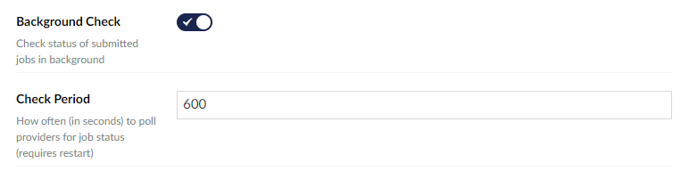

:::warning Not Available In This Version
From Umbraco V.9 you cannot edit these settings directly via the backoffice, you must update these settings in the `AppSetting.json` file
:::

By default Translation Manager will check the status of submitted jobs every 10 minutes. For some [Connectors](../reference/fundementals/connector) this will mean contacting their API and requesting the status of each job. 

You can change this default behavior in the [Global Settings](../reference/global) of Translation Manager.

- Background Check - Turn this setting off to stop checking completely.
- Check Period - Change how many seconds there are between checks.

:::danger Remember..
If you turn off background checking, all jobs will have to be manually checked to progress between submitted and received.
:::

  