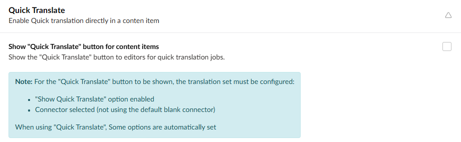

:::note
This setting works best for Machine and AI translation connectors.
:::

Quick translate allows you to machine translate your page at the press of a button. This is useful if you want to quickly translate one page without doing the whole site.

Quick translate is enabled by set. Once you have selected a connector for your set, you can to enable *"show "Quick Translate" button for content items"* to allow quick translate. 

Once this is selected, you can click on *Quick translate* at the bottom of a content item page to translate it immediately.
 
 

:::tip
Make sure you don't select *include children*, or the translation will Translate all the child pages, which will take much longer to process. You can hide the include children option in the Set Options section of the set settings.
:::