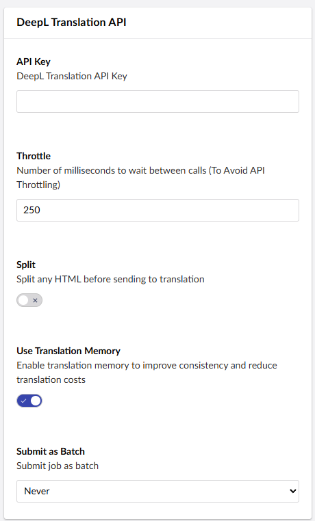
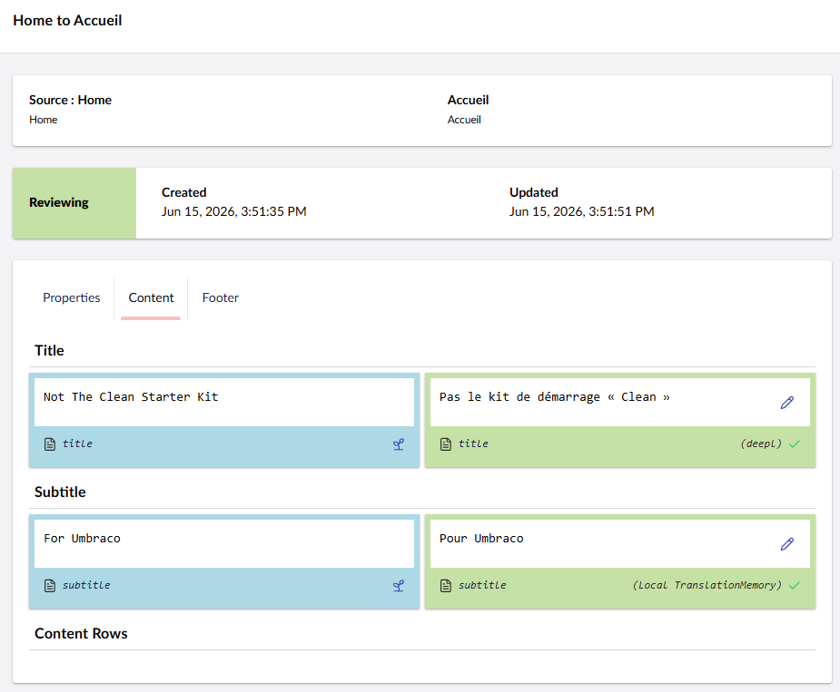
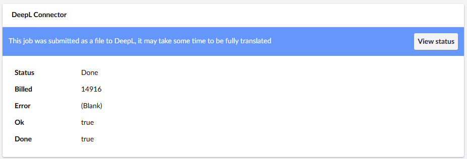
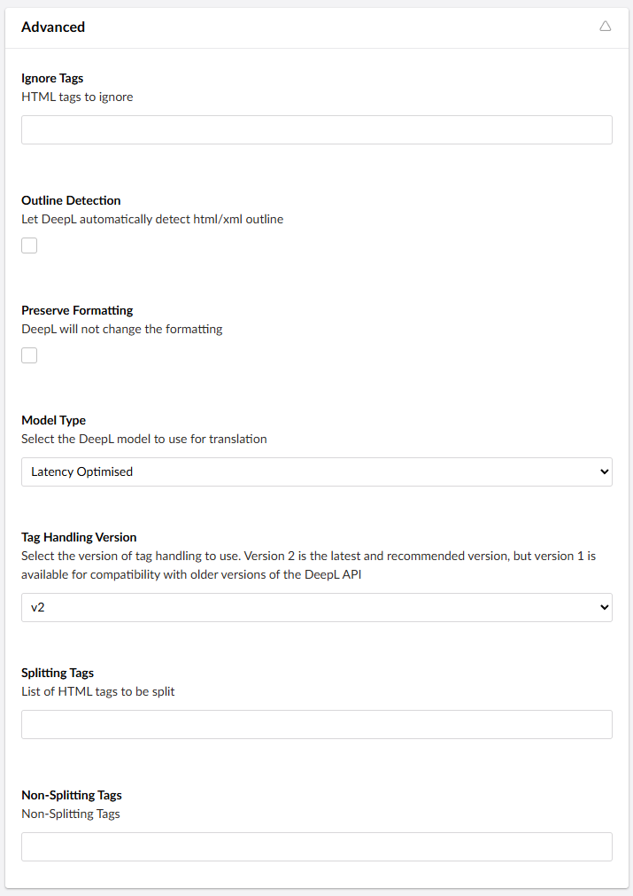
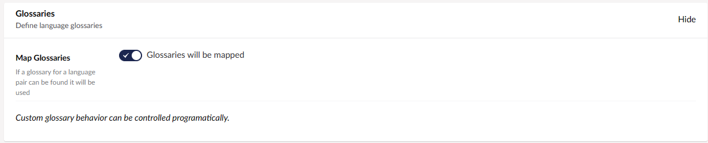
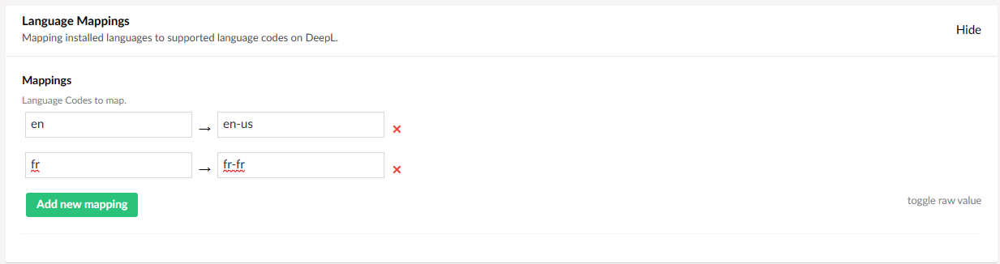

[DeepL Translations](https://www.deepl.com/en/whydeepl) is an advanced machine translation service. The connector will send your content to the DeepL service and return the content fully translated. 

## Installing

Before you install the DeepL connector you can check the current version on the [NuGet page.](https://www.nuget.org/packages/Jumoo.TranslationManager.Connector.DeepL/) 

You can install the connector via the command line: 

```
dotnet add package Jumoo.TranslationManager.Connector.DeepL
```

In order to use the DeepL connector you will need to configure a number of options.

## Translation Config 

These are the main settings for the DeepL connector. You will need to configure them in order to use it.



#### Throttle

Adjust the number of milliseconds between calls. This is to avoid API throttling.

#### Split HTML

Split any HTML into blocks before sending to translation. This allows the translation to run more smoothly, with less chance of lost data.

#### Translation Memory

As of version 17.1.0, the DeepL connector supports [Translation Memory](../../../userGuide/memory).  Translation Memory will remember words and phrases that have already been translated into your desired language. This way, the same words and phrases will not be translated over and over again, saving you money on translation. This setting is enabled by default. 



#### Submit Job as Batch

This setting allows you to submit translations as a [batch](../AIcon/batch), so it can work through large requests in the background without slowing you down.



## Advanced Settings

These are the advanced settings, for your more specific needs.



#### Ignore Tags

The HTML tags you want it to ignore.

#### Outline Detection

When enabled, DeepL will automatically detect a HTML or XML outline.

#### Preserve Formatting

When enabled, DeepL will not alter the formatting during Translation.

#### Model Type

Select your the DeepL model you wish to use.

#### Tag Handling Version

Change the version of tag handling that is used. This allows you to switch to previous versions for compatibility. 

#### Splitting Tags

List of any HTML tags that can be split.

#### Non Splitting Tags

List of any HTML tags that _cannot_ be split.

## Glossaries



When enabled, if a glossary for a language pair found it will be used. More info on configuring glossary settings on our [DeepL Glossaries](deepLGloss) page.

## Language Mappings



List of installed languages to map onto supported language codes on DeepL.

