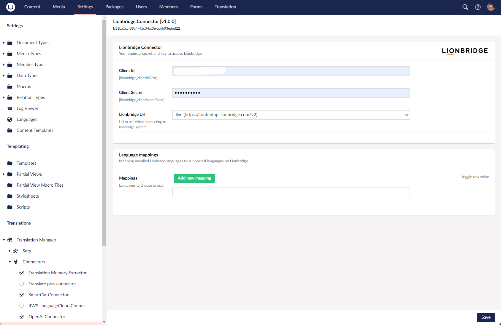

The Lionbridge connector allows you to connect your Umbraco installation to the [Lionbridge](https://www.lionbridge.com/) translation platform.

## Install the Lionbridge Connector 

You can check the current versions of the Lionbridge Connector on [the NuGet page](https://www.nuget.org/packages/Jumoo.TranslationManager.Lionbridge).

You can install the connector via the command line: 

```cli
dotnet add package Jumoo.TranslationManager.Lionbridge
```

or NuGet package manager:

```cls
install-package Jumoo.TranslationManager.Lionbridge
```

## Settings

Once you enter your licence key, for which you should consult your Lionbridge project manager, you will be able to see the Languagewire connector settings page. 



### Language Mappings

You should consult with your Lionbridge project manager on HTML configuration and language mappings as these can be used to tweak how information is sent to Lionbridge. 