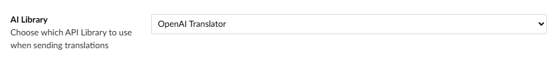
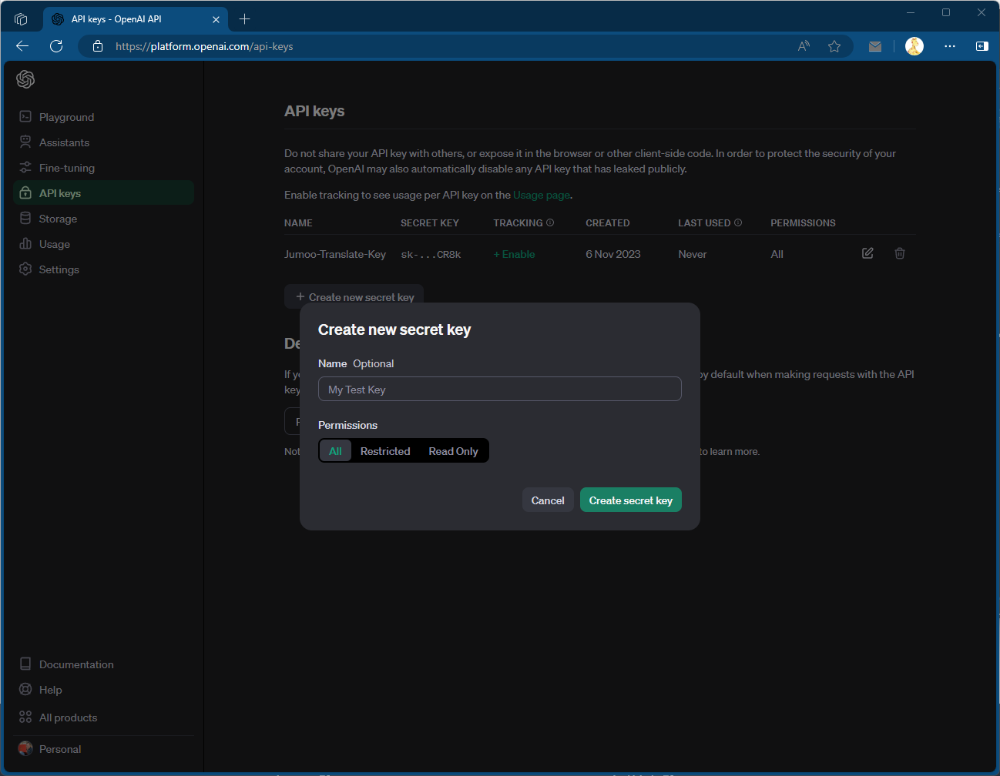
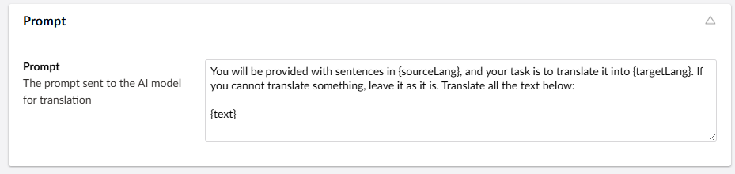

# AI Connector

The AI connector allows you to translate your site using a number of different Large Language Model (LLM) AI's.

:::tip
Translation AI can be complex and require tuning. The connector has a lot of specific settings that tune the API.

For more information on how the AI requests can be tuned you should refer your preferred AI provider's documentation.
:::

# Installing

:::warning
This connector is currently in preview.
:::

```
dotnet add package Jumoo.TranslationManager.Ai --prerelease
```

## Setting Up Your AI
Select your AI provider in the AI Library dropdown. This dropdown is in the connector settings.
 

This connector supports multiple AI providers, and they will all work slightly differently. For example, this is how you set up and use OpenAI. Consult your chosen AI provider's documentation for instructions. 

## For Example
These are basic instructions for using OpenAI to translate your site. Consult the [OpenAI Documentation](https://platform.openai.com/docs/concepts) for more information and detailed instructions.

### Generate an OpenAI API Key

You will need to generate an API key on the OpenAI website.

- Login to OpenAI.
- Naivigate to the API section.
- Create a new API key.



- Make sure you copy the generated key!

### Add Key to Connector Settings

- Paste the API key into the AI connector page within Translation Manager settings


### Connector Options

The AI connector options allow you to tweak how the connector talks to the API.

For more information on these settings consult the [OpenAI Documentation](https://platform.openai.com/docs/introduction).

### Prompt

All text is sent to the OpenAI in the form of a prompt, you can tweak how the prompt looks by changing the prompt settings in the connector.



For System based prompts (used by most language models), The prompt will be sent followed by a number of lines of text that will be translated by the model.

The connector will then take the values from the response and use them to form the basis for the translation that is returned to the system.
