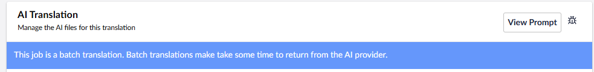
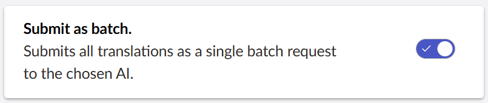

When you send lots of pages for translation, it can take a lot of time, and Translation Manager will have to throttle it so the AI doesn't get too many requests too quickly.

Batch mode allows you to group translations together and send them to the Translator AI at once. This way it can then work through them in the background and you can check back later to see if they have processed.

Batch mode can take a lot longer than interactive translation, for example, with OpenAI it can take up to 24 hours to process a batch translation, although its usually less than that. 

## Options

When you use batch mode, you can choose one of four settings:

#### Never
Never send translations via batch. 

#### Ask
Always ask the editor if they want to translate via batch when they creating a translation. 

#### Large 
Only use batch if you are sending more than 5 pages to translation.

#### Always
Always send translations via batch. 

## OpenAI Docs

For more information on these settings consult the [OpenAI Documentation](https://platform.openai.com/docs/introduction).
