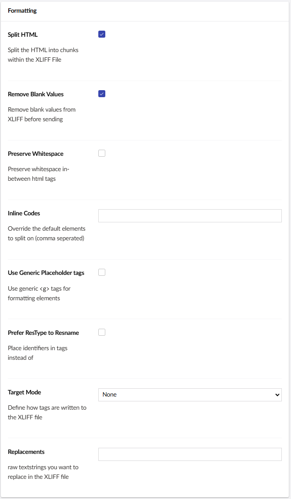
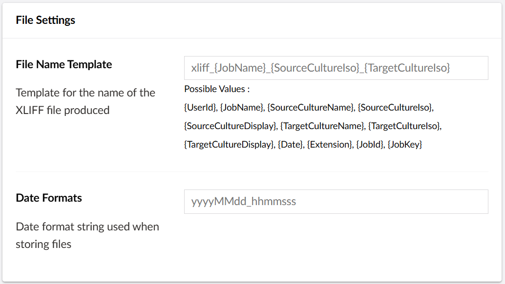

There are lots of ways the XLIFF connector can be configured. The default settings should work in the majority of cases but if you or your translation provider have some specific needs you can tweak the settings to meet them.

## Main Settings

The most common settings for the connector are on the main settings screen: 

|Settings | Note | 
|---| --- | 
| Folder | The location you want the connector to store the files. | 
| Format | The variants of XLIFF to use, the most common format used is XLIFF 2.0. |
| Extension | The file extension to use (e.g `mytranslation.xlf`). This is set to `xlf` by default but if you need to avoid using this extension name you can change it here.

:::warning
If you do change the extension, you should be sure to tell your translation provider. If they do not process the file as an XLIFF file the translations will not be in the correct location within the file when it is returned.
:::

## Advanced options
If you need finer control over the xliff file processing you can access the advanced settings dialog: 

:::Warning
You should only alter the advanced options if you understand the consequences on the produced XLIFF and how Translation manager processes the XLIFF files. These options are only intended to help when your translation provider requests something specific in how the XLIFF should be formatted or processed.
:::

### Formatting

The formatting options control how the XLIFF file is formatted:

| Option | Note | 
| - | - |
| Split Html | Split any HTML elements in to individual targets: for example, if you are translating a piece of rich text, each paragraph (inside `
` tags) will be split into individual translation items. This makes it easier for the translators, and more likely that translations will not mess up any HTML in your content. | 
| Remove Blank Values | Remove any values from the translation that might be blank (e.g. an empty text box).
| Preserve Whitespace | Keep any whitespace between elements. You usually don't need this, when html is split the space between tags will not be lost.
| Inline Codes | The HTML will not be split on elements added to this page. By default, content will be split on any HTML block level elements and not on inline elements (default: `<b>`,`<strong>`,`<i>`,`<em>`,`<u>`,` `,`<a>`,``). If you require the html to not be split on other elements (for example ``) you could add them to this page.
| Target Mode | How to handle the `<target>` attribute in a file. By default `None` we do not write this value into the file: `Blank` will write an empty target `<target></target>` value into the file next to each source. `Source` will write in the same value into the target as exists in the source value.

### Processing

The processing options control how any returned XLIFF files are processed

| Option | Note | 
| - | - |
|Multiple Files| This will generate an XLIFF file for each page, instead of for your whole site.
| Overwrite blank targets | When an XLIFF file is returned if it is missing any `<target>` values, Translation manager can use the value from the source as the target. This only works if the target does not need to be translated
| Match Languages |  Should the languages defined in the XLIFF file match exactly those in Umbraco ? Most of the time this doesn't matter. You (or your provider) may have mapped the language codes to something else, as long as the translated text is as intended.
| Language Mappings | Sometimes the languages you have installed on your site do not match exactly those supported by your translation company, for example your site might be setup in French (fr), but your translator expects French (France) (fr-fr). You can set a mapping here so when the file is processed it will send the language your translator is expecting. 

### Naming 

The naming options control how the files produced for a job are are named.

| Option | Note 
| - | - | 
| Filename Template | Name you want the file to have.
| Date Format | Format to use when naming. 

You can use multiple options to build your filename: 

| Value | Note | 
| - | - | 
| {UserId} | ID of the user creating a job (e.g 2).
| {JobName} | Name of the job (e.g "My translation job").
| {JobId} | ID for the job (e.g 1).
| {SourceCultureName} / {TargetCultureName} | Culture code of source (e.g "fr-fr").
| {SourceCultureIso} / {SourceCultureIso} | Iso Code for source (e.g "fr-fr").
| {SourceCultureDisplay} / {SourceCultureDisplay} | Display name of culture (e.g "France (French)" ).
| {Date} | Date (in date format) of the job.
| {Extension} | File extension (default xlf) for the filename.
