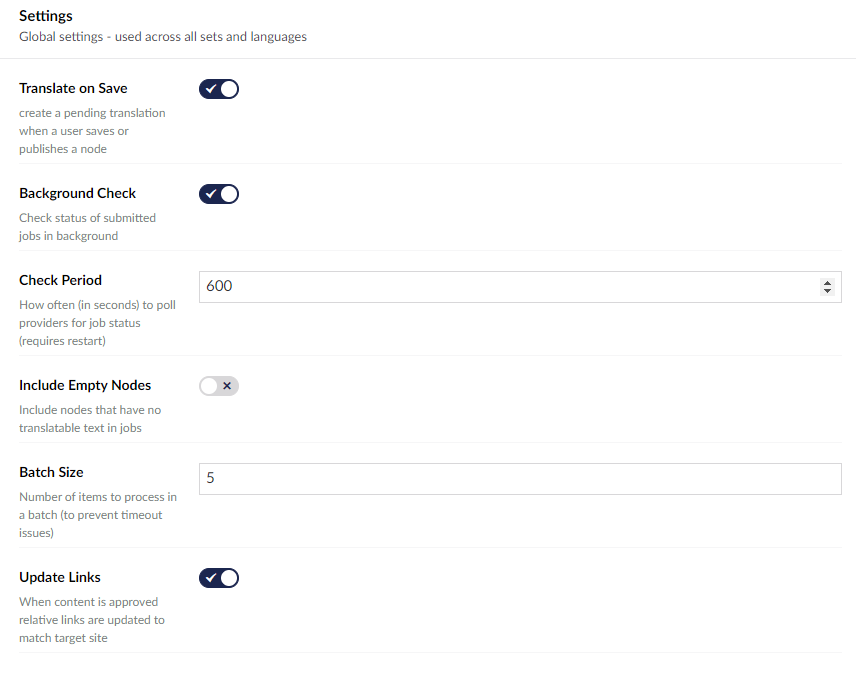

:::warning
In Umbraco v.9 and v.10 you cannot edit these settings directly via the backoffice, you must update these settings in the `AppSetting.json` file
:::

These are settings that can be set globally for all translations.

These are found in Settings -> Translation Manager.



## Settings 

### Update Links 
When content is approved, links will update to match the target site.

## Core Config

In Umbraco the global settings are read from the `appsettings.json` file.

:::tip
All these settings will have a default value and do not need set within the appsettings file, unless you are 
overriding the default setting.
:::

```json
{
    "Translation": {
        "backgroundCheck": true,
        "scheduleCheckPeriod": 180,
        "autoTranslate": true,
        "includeEmpty": false,
        "batchSize": 25,
        "history": true,
        "fixup": false,
        "returnToPending": false,
        "relationType": "relateDocumentOnCopy",
        "UniqueNestedIds": true,
        "CheckLinksOnLoopback": false,
        "autoTranslate": true, 
        "autoTranslatePublishOnly": false,
        "links": {
            "inline": true,
            "pickers": false, 
        },
        "notify": {
            "pending": "",
            "approved": "",
            "submitted": "",
            "received": ""
            "disabled": false,
            "subject": "Translations : [{job}] - {eventName}",
        },

        "mappers": {
            "inline":{
                "tags": "img,a",
                "attributes": "title,alt"
                "strict": true,
            }
            "text":{
                "text": "string.Empty",
            }
        }
    }
}
```


### Background Check
Periodically checks the status of submitted [Jobs](fundementals/job) automatically.

### Check Period 
The number specifies how often the background check occurs.

### Include Empty Nodes 
Include nodes with no translatable text in jobs.

### Batch Size 
Number of items to process in a batch (if you are experiencing timeouts, try lowering this number).

### history
Shows the history tab on a job. This allows you to see events. This setting is on by default

### returnToPending
Put translated content back into the pending queue if a job is cancelled. May cause conflicts. This setting is off by default.

### relationType
Default Umbraco relation used to link pages across languages. 

### UniqueNestedIds
Ensures that block and nested items get unique internal IDs when tranlated into other languages. By default these IDS are seperate, but depending on your set up you may want them to remain the same. 

### CheckLinksOnLoopback
Toggle whether or not links within content are checked on translations that are using variants. By default, links are only checked on translations between two different sitenodes. 

### autoTranslate
Saves the changes that have been made into the *Pending*.

### autoTranslatePublishOnly
Only published items are put into the pending queue

### hideLicenceTab
Hide the licence tab from the UI. This setting is useful if you dont want anyone to see the licence key.

### fixup
Turns on debugging in interface by default, so you can delete the things you can't usually delete. You can turn this on per request by adding `&tm=debug` to the url.

### notify
The email adresses that notifs will be sent to when jobs reach a certain stage.

### subject
The template for the subject is ID, source, and target, ID. The ID is the job ID, the source is the source language, and the target is the target language. The options for eventname are pending, approved, submitted, and recieved

## mappers
Mappers are explained on the [Property Mapping page](../extending/mapping/index). 
