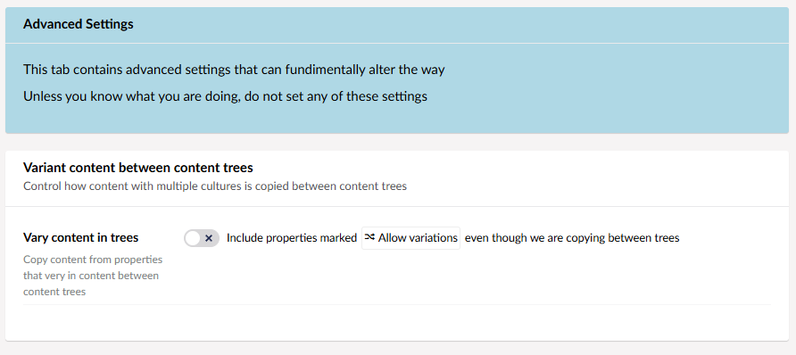
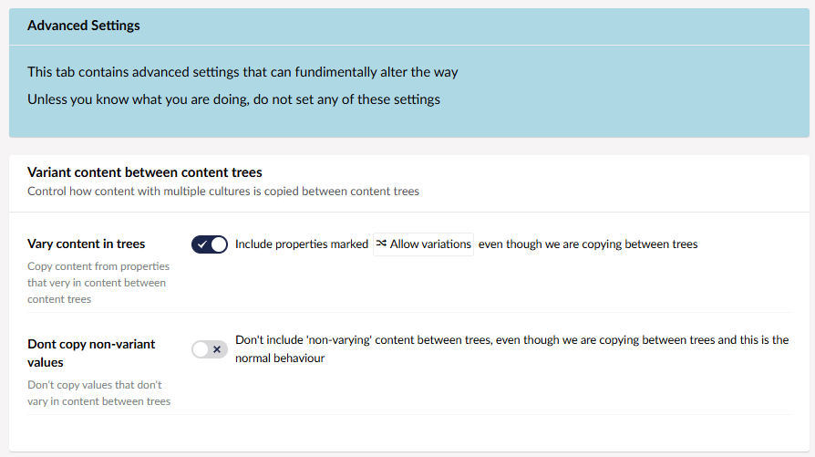

# Advanced Variant Settings

When you are using variant pages to keep the various language versions of your site in check, you can usually get by with a single tree. However, sometimes you might be using more than one tree to manage your content, and want to translate between your variant pages. This is where the advanced settings come in. 

## Finding Advanced Settings

To change the advanced settings for variant translations in the backoffice, you need to make them available in the appsettings.json file. 

To do this, add the advancedSetCopyRules setting...

```JSON
  "Translations": {
    "advancedSetCopyRules" : true
  }
```
...to the appsettings.json file.

Then, in the back office, you can then go to Settings -> Translation Manager, click on your set, and click on the "advanced" tab in the top right corner. This will show you the *Vary content in trees* setting.

## The Settings

### Vary Content in Trees



When enabled, this setting allows you to copy content from properties than vary in content between content trees. This means that you can translate to and from different variant pages. 

When you enable this setting, the *Don't copy non-variant values* setting will appear below it.

### Don't Copy Non-Variant Values



This setting, when enabled, excludes non-varying content from copying between trees, ensuring that *only* your variant pages will translate. 