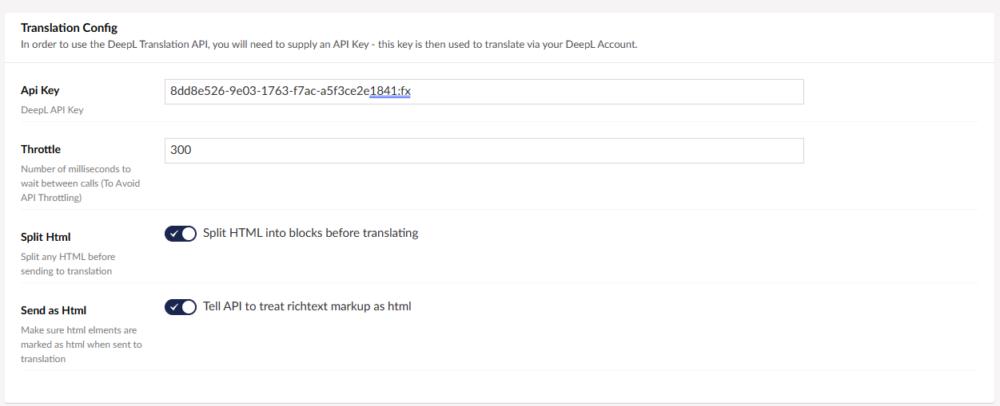
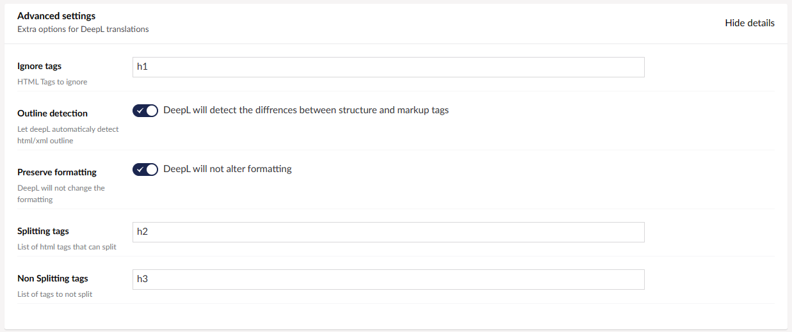
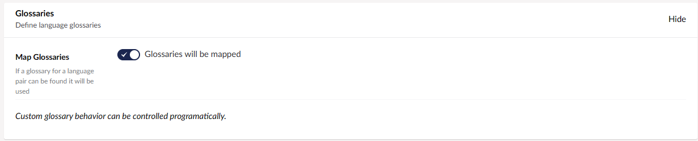
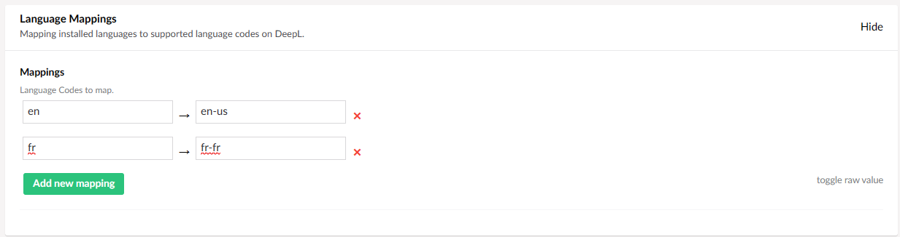

[DeepL Translations](https://www.deepl.com/en/whydeepl) is an advanced machine translation service. The connector will send your content to the DeepL service and return the content fully translated. 

## Installing

Before you install the DeepL connector you can check the current version on the [NuGet page.](https://www.nuget.org/packages/Jumoo.TranslationManager.Connector.DeepL/) 

You can install the connector via the command line: 

```
dotnet add package Jumoo.TranslationManager.Connector.DeepL
```

In order to use the DeepL connector you will need to configure a number of options.

## Translation Config 

These are the main settings for the DeepL connector. You will need to configure them in order to use it.



#### Use Free API

With DeepL you have the options of a free translator, or paid for versions with more benefits. With this option you can use the Free DeepL Translator's API. Information on DeepL's paid for plans is available [here.](https://www.deepl.com/pro?cta=header-prices/)

#### Split HTML

Split any HTML into blocks before sending to translation. This allows the translation to run more smoothly, with less chance of lost data.

#### Send as HTML

This will allow the API to treat richtext markup as HTML.

## Advanced Settings

These are the advanced settings, for your more specific needs.



#### Ignore Tags

The HTML tags you want it to ignore.

#### Outline Detection

When enabled, DeepL will automatically detect a html or xml outline.

#### Preserve Formatting

When enabled, DeepL will not alter the formatting during Translation.

#### Splitting Tags

List of any HTML tags that can be split.

#### Non Splitting Tags

List of any HTML tags that _cannot_ be split.

## Glossaries



When enabled, if a glossary for a language pair found it will be used. More info on configuring glossary settings on our [DeepL Glossaries](deepLGloss) page.

## Language Mappings



List of installed languages to map onto supported language codes on DeepL.
