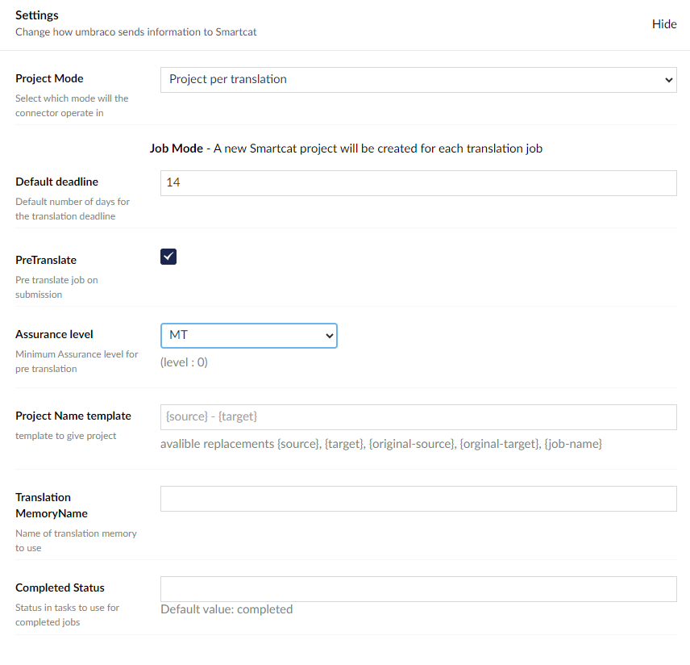

Using its Language Delivery Platform, Smartcat will translate your files for you quickly and easily.

To get the Smartcat Connector you will need to [sign up to Smartcat](https://smartcat.com/) and install the connector via the commandline:

```cli
dotnet add package Jumoo.TranslationManager.Smartcat
```

or NuGet package manager:

```cls
Install-Package Jumoo.TranslationManager.Smartcat
```

Once you have installed the Smartcat Connector, go to Settings --> Translation Manager --> Connectors --> Smartcat Connector. You will need to enter your Account ID, API Key, and Client ID. These can be found via the Smartcat Website, linked above.

The API key and Account ID can be found in Workplace Settings. Client ID can be found by clicking on a client and then looking in the URL.

# Connector Settings

Once you've got everything in place, you can adjust the settings to your needs.

## Settings



### Project Mode

the Smartcat connector allows you to work with Smartcat projects in a number of ways:

- **Project per Translation**

  One project will be created for each translation.

- **Project per Language**

  All translations for any given language will go into a single project inside Smartcat.

- **Single Project**

  All translations will go into a single project inside Smartcat.

> When using "Project per translation" or "Single project" some functionality, such as remove job, will not remove items from Smartcat. This is because removing the project could remove files from other translation jobs

### Default deadline.

The default number of days from submission to set the translation deadline. Changing deadlines can effect costs and delivery. You should be clear with your translation project manager about the consequences of changing this value.

### PreTranslate

Toggle if SmartCat will attempt to pre-translate the job on submission.

### Assurance Level

This relates to the [Translation Quality Score](https://help.smartcat.com/understanding-translation-quality-score/?roleuser=end&cat=1706804187464144).

### Project Name Template

Allows you to classify how the project names will be created for Smartcat.

You can use the following tags in the template to define how the name is created.

| Tag | Summary |
|--|--|
| source | Source language (e.g en-us).
| target | Target language (e.g fr-fr).
| orginal-source | The orginal source language (before language mapping).
| orginal-target | The orginal target language (before language mapping).
| job-name | Name of the translation job in Umbraco.

### Complete Status

The status of a job inside Smartcat that Translation Manager will consider the job complete and attempt to download the translated content.

## HTML Settings


### Split on 'Span'

Split the HTML content when encountering a `<span>` element. Mostly span elements can be treated as inline content, and content with a span element will be translated as a single block of text. Depending on the content on your site, you may wish for the content to be split on spans.

### Spaces After Blocks

Depending on formatting you may find that blocks of HTML are merged back into your site without blank spaces between them. This can affect layout of the html page. Setting the "Spaces after blocks" toggle will ensure spaces are added to end of HTML blocks.

## Language Mappings


Language Mappings allow you to map an Umbraco installed language to one used on smartcat.

For example, your site might be built using the "French [fr]" language but SmartCat requires you to define a more specific version such as "French (france) [fr-fr]", a mapping of `fr=fr-fr`would cause Translation Manager to map all "French" content to "French (france)" when sending data to smartcat.

## Debug Settings


### Save Files

Files sent to Smartcat will be saved in the temp folder (`/umbraco/data/temp/smartcat`), if you encounter issues with the files in smartcat the debug file can be used to confirm the data that has been sent.
