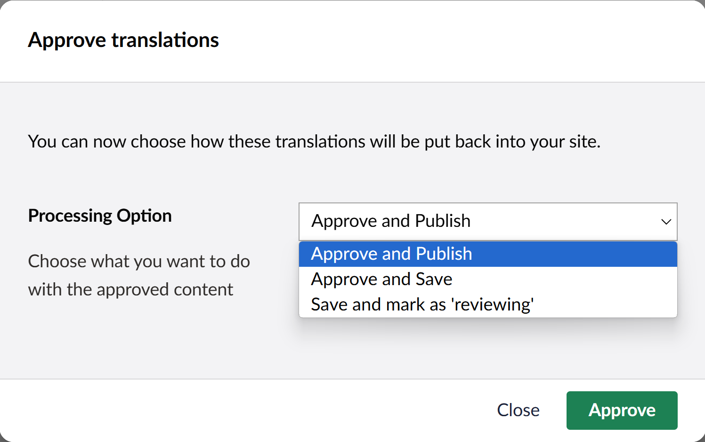

When a job has been received from your translators it will progress into the "Received" area. 

At this point you can check the content to see what has been returned, editing or removing translations as required.

## Approving Content 

There are three buttons at the bottom of the screen when viewing a recieved translation.

- Archive

     - Archives the translation job, **but doesn't save the content to Umbraco.** 

- Reset
    
     - Resets the job back to submitted.
    
        > This is useful if you require the [Translation Connector](../reference/fundementals/connector) to reprocess the job.

- Approve
     - Opens the Aprrove Translations pop-up.

If you are happy with the returned content you can approve the [translation job](../reference/fundementals/job) and return the content to your site. 

When you click approve, you will be given a pop-up with three processing options. 

- Approve and Publish

     - Saves the translated content back into your Umbraco site, and publishes it. This will make the translated content live on your website. 
    
     - Marks the translation job as *Complete*.

     - Archives the translation job. 
     

- Approve and Save

     - Saves the translated content back into your Umbraco site without publishing. 

     - Archives the translation job.

- Save and mark as 'reviewing'

     - Saves the translated content back into your Umbraco site.

     - Leaves the job in received.

     

