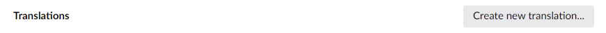
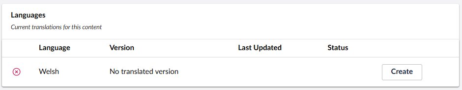
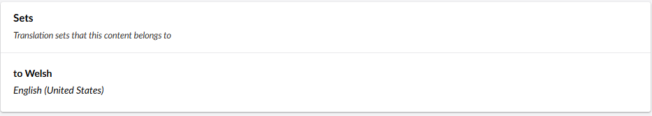
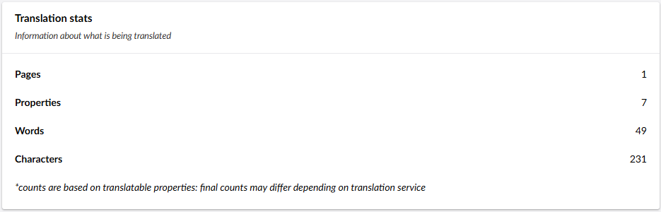

The Translations content app can be found on each content page. Select the Translations tab in the top right corner. 

Once you have opened this tab, depending on your settings, you will see a mixture of boxes.
<!--
### Translations 

To create a new translation, you can click "Create new translation...".
--->

### Languages

This setting will show you the latest translation job containing this page, the date of the job, whether it is current, and how many versions behind it is.

### Sets

This box displays the translation sets that your page belongs to. From here you can go directly to the Translation Set and edit its settings. 

:::note
This tab may not be visible, or may not be editable, depending on your permissions.
:::

 

### Translations Stats

This box tracks what is being translated, such as number of properties, estimated words, and estimated characters. 

:::note
The character and word counts displayed here may differ from the ones of your translation provider. Different systems can use different methods for counting these.
:::