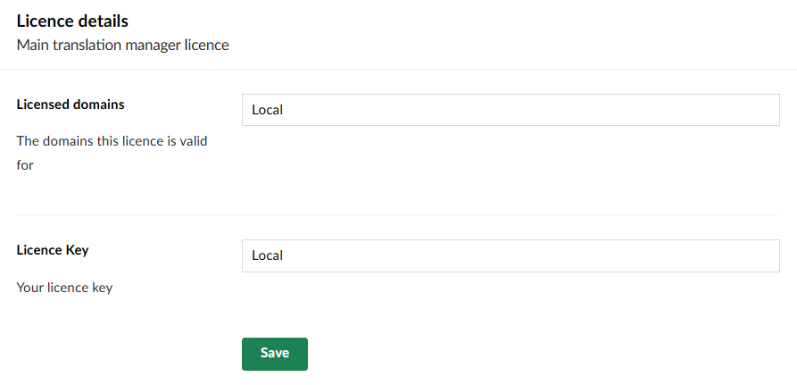

## Licence Warning Message

When you first install and use Translation Manager you might see a blue box, telling you about licence restrictions.

We've added the warning box so people understand the limitations of the free version. It doesn't change how Translation Manager works (free for two languages, one source, one target). But it just gives you a heads up that going live might require you to purchase a licence.

## Can I Remove the Blue Box?

### Yes.

If you know you only want to work with two languages and would rather the box went away, you can go to Settings -> Translation Manager -> Licence. Enter 'Local' into both of the *Licence Details* boxes.

 This will not remove the limits, but it will stop the box from showing up.

### Or...
You could purchase a licence - if you want to work with more than two languages, you are going to need a valid licence, and when you have one the box goes away.