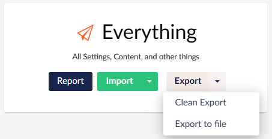

## What is an Export?
the uSync export process takes everything from within your Umbraco site and writes the settings, content, media to disk in the uSync folder. This can then form the basis of any reporting or importing you do on this on other Umbraco sites you copy the uSync folder to.

:::note
By default, uSync will export the changes for individual items to disk every time they are saved within Umbraco, for normal operation you probably won't need to manually run an export as uSync's "export on save" operations will keep the files on disk in sync with your installation.
:::

## Running an Export

To run an export you click on the export button either within a specific group (e.g export all settings), or in the everything group.

uSync will run through all the relevant items within your site, and write their settings to disk, this will overwrite any files already on disk for these items. 

### Should I Run a Clean Export?

You may notice that on the export button in the "Everything" group you can select "Clean Export". 

A clean export will first remove all existing files from the uSync folder. If you have orphaned or merged files within the uSync folder they will be **deleted** so you can be sure that only the items from your Umbraco install are within the uSync folder. 

### Dangers of a Clean Export 

When you delete an item within Umbraco, uSync will create a 'empty' marker file in the uSync folder, so when a report or import is ran on the folder uSync will know to delete any items that match the fingerprint in the file.

When you run a clean export these marker files will also be deleted and because the items no longer exist in your Umbraco site, nothing will be written to disk. **You will essentially lose these delete events**.

This is fine if done deliberately, but it's better to proceed with caution. For more information visit the [Import/Export Options](../guides/importExport) page of the documentation.

