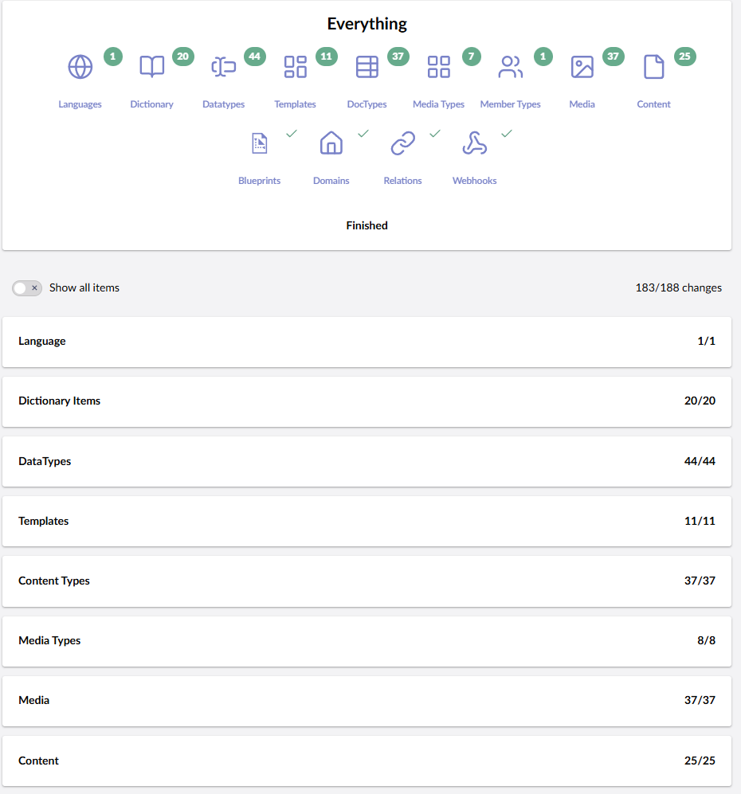

## What is a Report? 

Within uSync a report will tell you what differences exist between the files in the uSync folder and the settings within your Umbraco setup. No changes are made to your Umbraco setup when you run a report.

##  Running a Report

To run a report you click on the report button either within a specific group (i.e settings) or for everything. 

## Understanding a Report 

The report will then run and show you the differences between the files on disk and your setup. 

The list at the bottom of the page will show you the items that are different between the files on disk and your setup, the report will tell you what would change if you where to import the changes from disk onto your Umbraco site. 

|Item|Note|
|--|--|
|Type|The type of item inside Umbraco e.g a Content item or a ContentType.|
|Name|Name of the item.|
|Change|The type of change that will occur if the item is imported (e.g update, create, delete).|
|Message|Any additional messages that uSync may want to report about an item|
|Details|Link to the details of the change.|

## Change Details
For each change in a report uSync can show you the details of the change, so you can see exactly what is different between the files in disk and your setup. If you click on the details link you will be shown the individual changes on an item.

Much like for the main report, you will see a line for each change, and details of what type of change will be made. 

Within the changes table the 'Difference' column will show you change in an item, any new content will be marked in green, while things that are being removed will have a line through them and be marked in red. 

### Individual Import

After a report, you can import individual changes by clicking on the import button in top right corner of the details. Clicking this button will import **only** that change. If there are any dependencies, those will need resolving manually for everything to work properly. 