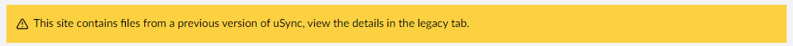
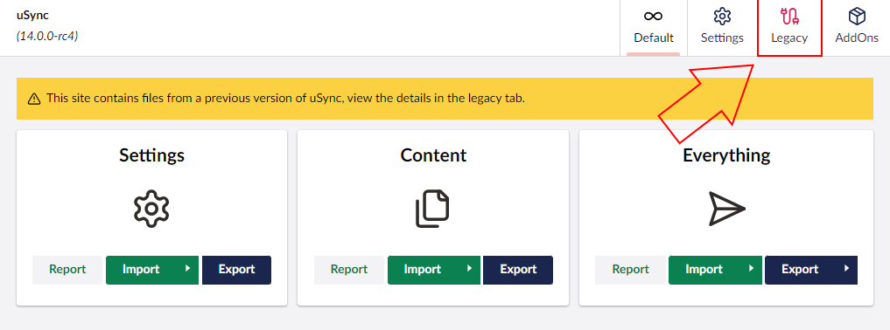
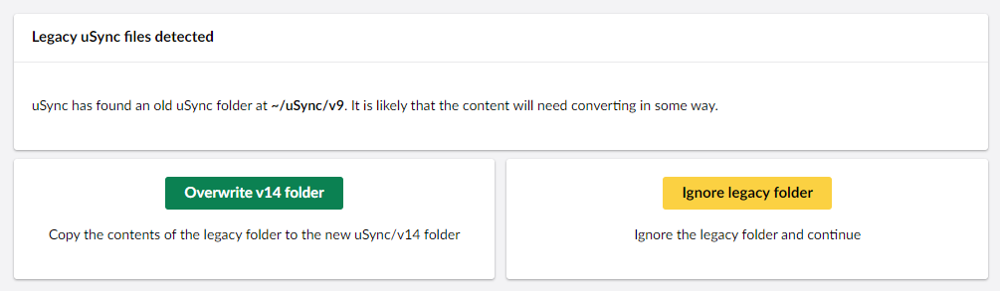

You can upgrade uSync by entering `dotnet add package uSync` into the commandline, just like downloading it.

## Keep Your uSync Folder Up to Date 
Occasionally an update in Umbraco or uSync functionality will cause us to make a change in the format/detail of the uSync `.config` files. When this happens, we will increment the 'format version' of the files and uSync will warn you that the files might be using an old version.

 Within a major version and often between major versions the files will still be compatible but changes can lead to "false positives" when checking files.

:::tip
Checks are always faster then import operations, To minimize "false positives" in uSync when checking files, perform clean exports after you upgrade uSync minor versions (e.g 10.0 -> 10.1).
:::

## v14 and uSync Folders

As of v14, if uSync finds a legacy folder it will flag it with this warning:

When uSync finds a legacy folder you will also get access to the Legacy tab. 

Clicking on this tab will lead you to the Legacy page. 

This page gives you two options, Overwrite and Ignore.

If you choose to overwrite the legacy folder, uSync will copy the contents of this legacy folder into the new folder. It will also add a .ignore file to the legacy folder, removing the Legacy tab and the warning.

If you choose to ignore the legacy folder, uSync will *just* add a .ignore file to the legacy folder, removing the warning and the Legacy tab, but otherwise leaving your two files unchanged. 

In both cases, deleting the .ignore file will bring back the Legacy tab and the warning. 