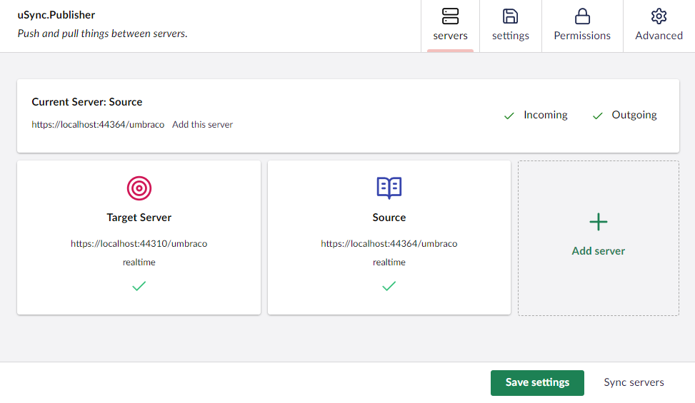
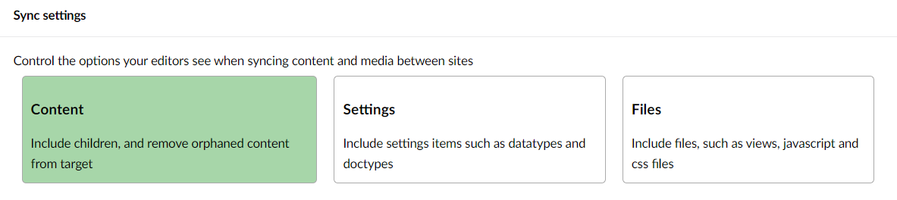

# uSync.Publisher Server Config

From uSync v9, the Server config is stored in the database for each site. The settings can be controlled via the uSync Publisher dashboard on any server.

The settings can be synchronized between servers by using the "Sync settings" option at the bottom of the dashboard, this will then push your server settings between servers. 

## Sync Settings

There are three Sync Settings to choose from. 

| Name | Description |
| - | - |
Child Content | Include children and remove orphaned content from target.
Settings | Include settings items such as datatypes and doctypes.
Files | Include files, such as views, javascript and css files.

