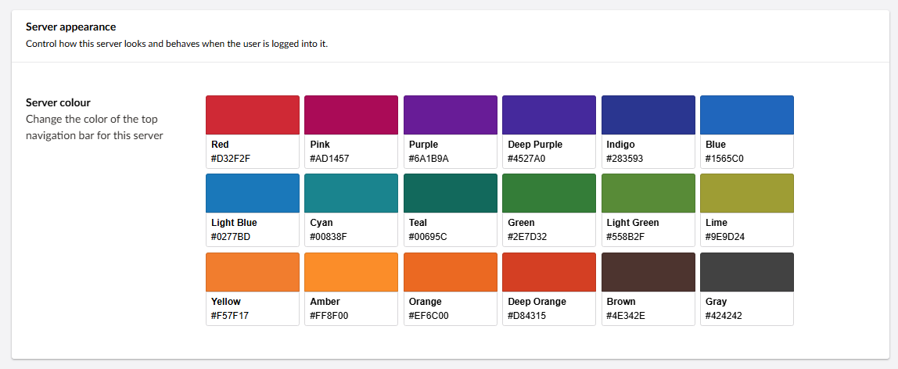
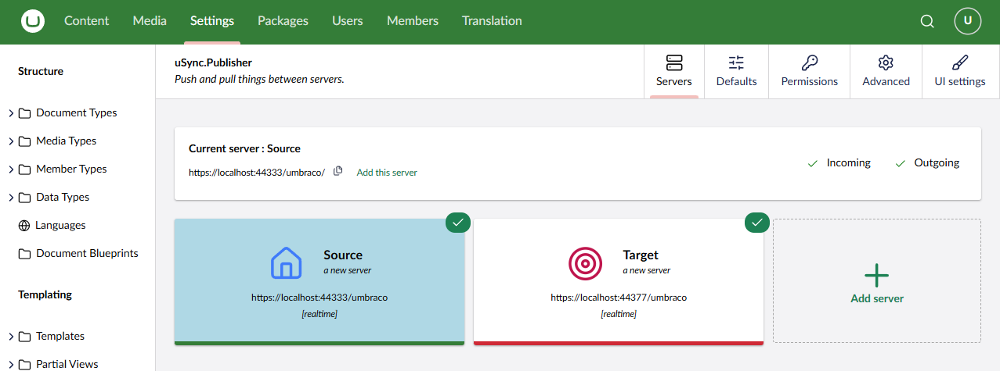

The Ui settings give you options for personalising the backoffice for your servers so you can tell which server you're editing at a glance, as well as the ability to hide content action buttons you don't want to press. 

UI SETTINGS ARE WHERE THEY ARE TELL THEM WHERE THEY ARE. 

## Server Colours 

The server colours allow you to choose the colour of the navigation bar at the top of the backoffice. This means you can tell the difference between the backoffice of your servers at a glance, as well as giving you an element of personalisation. 

## Hiding the Content Action Buttons

You can customize the content action buttons to your specific needs, hiding the ones you don't want to see. You can bring them back any time, but in the mean time you can avoid any editor confusion 