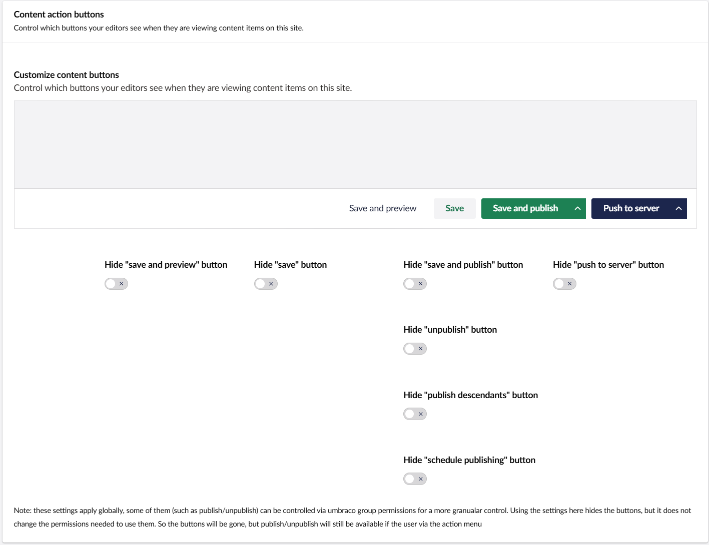

The UI settings give you options for personalising the backoffice for your servers so you can tell which server you're editing at a glance, as well as the ability to hide content action buttons you don't want to press. 

The UI settings tab is available in the top right corner of the uSync.Publisher settings page, as well as the top right corner on a specific server page. 

## Server Colours 

You can now choose the colour of the navigation bar at the top of the backoffice. This way you can tell the difference between the backoffice of your servers at a glance, as well as giving you an element of personalisation. 

## Hiding the Content Action Buttons

You can customize the content action buttons to your specific needs, hiding the ones you don't want to see. You can bring them back any time, but in the mean time you can avoid any editor confusion. 

With these settings you can: 
- Hide the "Save and preview" button. 
- Hide the "Save" button.
- Hide the "Save and publish" button altogether, OR:
  - Hide the "Unpublish" option.
  - Hide the "Publish descendants" option.
  - Hide the "Schedule publishing" option.
- Hide the "Push to server" button.

In any arrangement you want, so that only the options you need to use show up in the backoffice.

:::tip Remember!
These settings will hide certain buttons, but they will not change the permissions needed to use them. If a user has the right permissions, publish/unpublish will still be available via the action menu.
:::