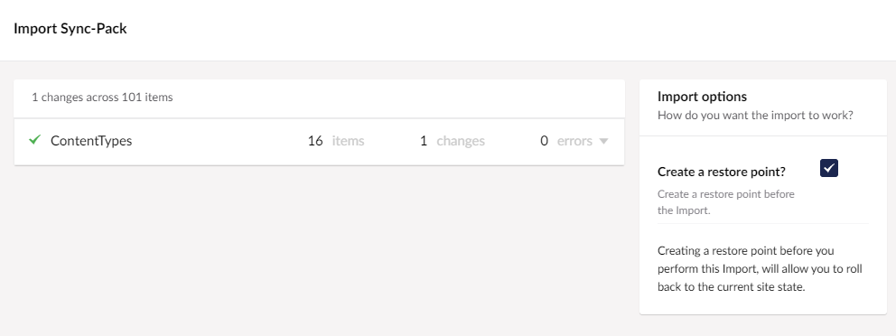
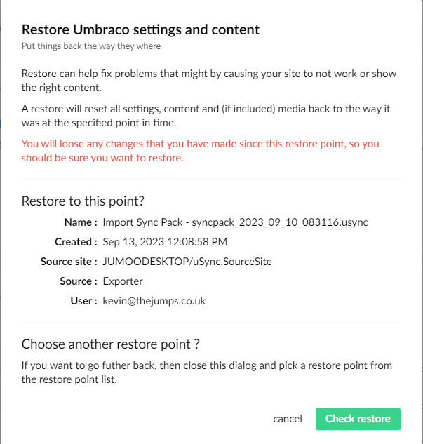
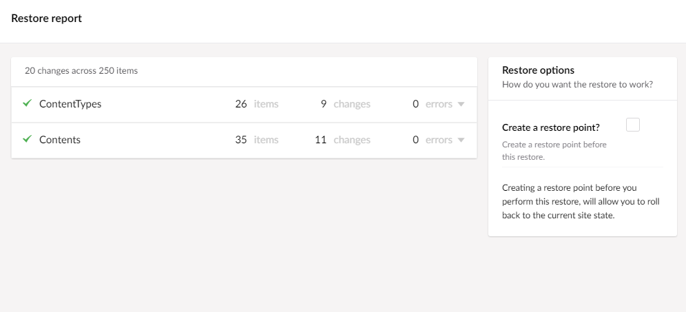

Restore points are a point in time backup of your site, they contain everything you need to get your site back to where it was when the restore point was made. This means you don't have to worry about making new changes, as you can always rollback changes that didn't work


### How do Restore Points Work?

A restore point is an archived file of all yours site’s settings, content and template files. This includes all the things uSync will sync, plus .cshtml, css, and js files in the wwwroot, wwwroot/css. wwwroot/scripts folders. If you want it can also include all of your media.

### Where are Restore Points Stored?

Initially restore points will be stored in the sites `/uSync/restore` folder but this can be configured in the configuration. We also have an Azure blob storage provider, so you can push your restores into the cloud.

## Create Restore Points

You can create restore points in several ways:

#### 1. Via the Restore Dashboard

You can go to the restore dashboard under the uSync tree in settings. From there, click the green button.


When creating the restore point you will be asked if you want to include media files. If you have lots of media, especially if some of it is large, this can slow down restore point creation by quite a bit. If your media is already backed up (e.g via blob storage) then you shouldn't pick this option.

#### 2. During a Push/Pull Operation

 uSync.Publisher will detect when you are making potentially damaging changes, and prompt you to create a restore point. Additionally, you can configure uSync.Publisher to create a restore point each time you push or pull content.


*Restore points are created on the target site (the one you are pushing to, or the site you are pulling to).*

 >**What is a ‘Damaging Change’?**
>
 >uSync will keep your sites in sync, and in general that is what you want. However, there are changes you can make to a site that can have wider implications than the specific content or settings you are syncing. When this happens uSync.Publisher will tell you.
>
 >For example, if you delete a property in a ContentType then when that element is synced with another site Umbraco will remove any content associated with that property from all pages that might be using it. So if you were to delete the pageTitle property from a content type you might loose all your page titles.
>
 >Creating a restore point before changes like this can protect you from loosing content you might not be expecting to be removed.

#### 3. Before a Sync-Pack Import

Before you import changes from a Sync-Pack file using uSync.Exporter, you are now given the option to create a restore point.



Creating a restore point before a big import gives you peace of mind should it do things you are not expecting.

## Restore Your Restore Points

Should the worst happen and you need to rollback to a restore point, you can do this via the Restore Point dashboard.


Simply select the restore point you wish to rollback to, or click on restore latest, and you will be given the opportunity to run a check on the restore point.



Running a check will report the changes that would happen should you choose to run the restore point.
Once checked, you can view the report to view any changes. If you want, you can even create a pre-restore restore point, so you can roll back the changes from the restore point if you need to.



### Cloud Based Restore Points

By default restore points are saved in the `uSync/Restore` folder of your site. This will be fine for a lot of situations, but if for some reason it isn't you can put them somewhere else. 

Therefore, the uSync.Complete.Restore.Azure package allows you to put the restore point into azure from config.

```

  "uSync": {
  "Restore": {
    "Storage": {
      "Azure": {
        "ConnectionString": "**** YOUR AZURE CONNECTION STRING ****",
        "ContainerName": "**** YOUR AZURE CONTAINER NAME ****"
      }
    }
  }
}

```


