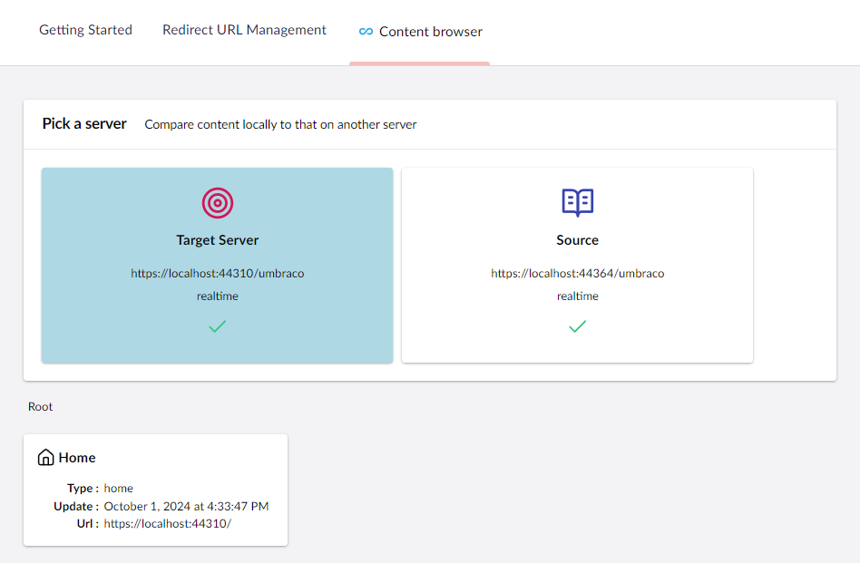
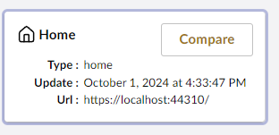
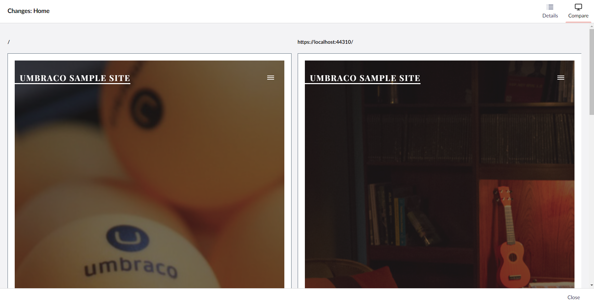

The Content Browser tab allows you to look at your site's changes side by side before you sync anything. This allows you to see exactly what will change and how.

## Navigating Remote Content

The Content Browser tab can be found on the content root in the Umbraco backoffice, and will let you to look over differences in your remote content. 

You will then have the option to click on a local, or a remote server, checking for differences between them.

If there are any differences, uSync will mark it different, and offer you the option to compare the differences.

This button will display a comparison of your two sites, allowing you to manually check everything that has been changed before you push your changes.

If youre happy from here you can push your changes, assured that there are no unexpected differences coming.  

