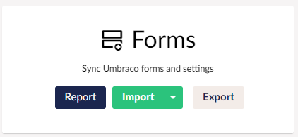
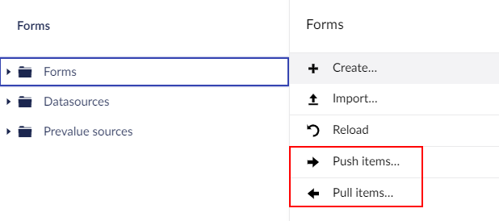

To install and use uSync.Forms you will first need to install [Umbraco Forms](https://umbraco.com/products/add-ons/forms/). 

## Installation

To Install uSync.Forms, type the following commands into the command-line.

```cli
dotnet add package uSync.Forms
```

## Using uSync.Forms

Once uSync.Forms is installed, you should see the Forms entry on the uSync dashboard.




### With uSync.Complete

If you have uSync.Complete you can right click on a form to push or pull it.



For these options to appear you need to install an additional package:

```cli
dotnet add package uSync.Forms.Complete
```
