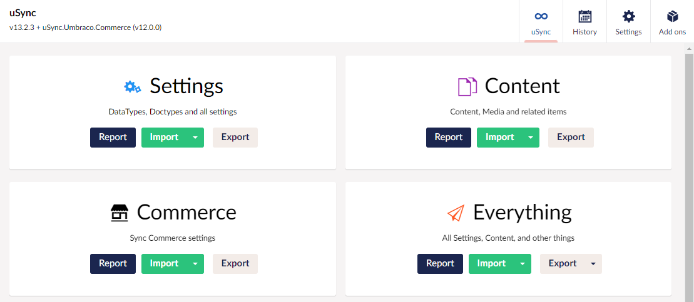

To install and use uSync.Umbraco.Commerce you will first need to install [Umbraco Commerce](https://umbraco.com/products/add-ons/commerce/). 

## Installation

To Install uSync.Umbraco.Commerce, type the following commands into the Visual Studio Package Manager Console, command line, or add the reference directly into the .csproj file.

import Tabs from '@theme/Tabs';
import TabItem from '@theme/TabItem';

<Tabs
  defaultValue="core"
  values={[
    { label: 'Dotnet', value: 'core', },
    { label: 'Package reference', value: 'ref' }
  ]
}>
<TabItem value="core">

```cli
dotnet add package uSync.Umbraco.Commerce
```

</TabItem>
<TabItem value="ref">

```cli
<PackageReference Include="uSync.Umbraco.Commerce" Version="VERSION" />
```

</TabItem>
</Tabs>

## Using uSync.Umbraco.Commerce

Once uSync.Umbraco.Commerce is installed, You should see the Commerce entry on the uSync dashboard.




### With uSync.Complete

If you have uSync.Complete you can right click on a store to push or pull it.


