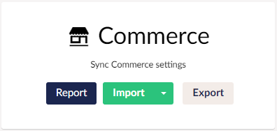

:::warning Not Yet Implemented
This option is not yet available in version 15.
:::

uSync.Umbraco.Commerce is an add-on package for Umbraco Commerce, providing a drop-in integration with uSync in order to make effortless deployments between environments.

With uSync.Umbraco.Commerce, Umbraco Commerce settings are automatically serialized to disk as changes happen. Once transfered, other environments can easily be reported on to review changes and imported with progress indicators.

To install and use uSync.Umbraco.Commerce you will first need to install [Umbraco Commerce](https://umbraco.com/products/add-ons/commerce/). 

## Installation

To Install uSync.Umbraco.Commerce, type the following commands into the Visual Studio Package Manager Console, command line, or add the reference directly into the .csproj file.

import Tabs from '@theme/Tabs';
import TabItem from '@theme/TabItem';

<Tabs
  defaultValue="core"
  values={[
    { label: 'Dotnet', value: 'core', },
    { label: 'Package reference', value: 'ref' }
  ]
}>

<TabItem value="core">

```cli
dotnet add package uSync.Umbraco.Commerce --version 13.1.0-rc1
```

</TabItem>
<TabItem value="ref">

```cli
<PackageReference Include="Umbraco.Commerce" Version="13.1.6" />
```

</TabItem>
</Tabs>

## Using uSync.Umbraco.Commerce

Once uSync.Umbraco.Commerce is installed, You should see the Commerce entry on the uSync dashboard.




### With uSync.Complete

If you have uSync.Complete you can right click on a store to push or pull it. 


