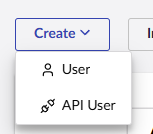
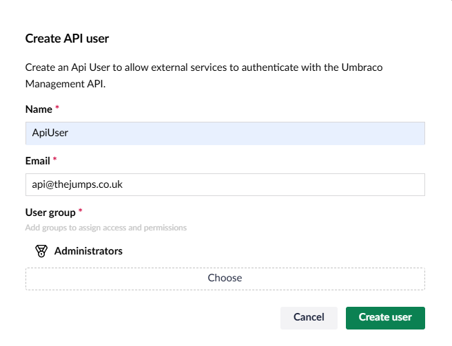
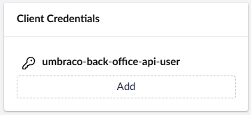
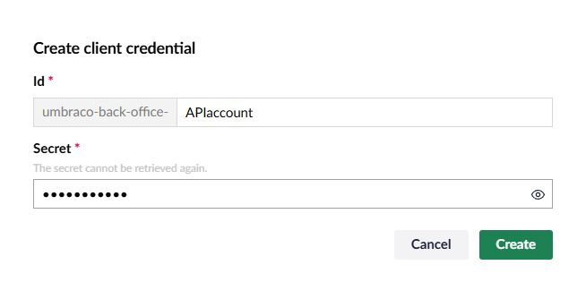

In order to use uSync.CommandLine you have to make an API user. You can do this in the users section of Umbraco.



Create the API user and add them to the relevant group!



## Add a Client Secret and Key

Once you have created an API user, you will need to give them a Client ID and Secret.



You will need both the Client ID and a Secret to connect via the command-line.



## Add an appsetting.json File

You can add an appsettings.json file to the root of the folder where you are running uSync.CommandLine:

```json
{
  "uSync": {
    "Command": {
      "Secret": "[CLIENT_SECRET]",
      "ClientId": "[CLIENT_ID]"
    }
  }
}
```
## Or Use the -k -i Settings

Alternatively, you can pass these on the CommandLine. eg.

`usynccli usync-ping -s https://localhost:44359 -s [client_secret] -k [client_id]`

Once this is set up, you can use all the [Commands!](Commands)