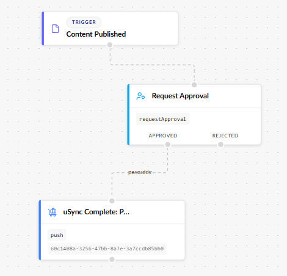

:::tip Versions
uSync.Automate is for Version 17, but it will work with Version 18.
:::

uSync.Automate allows you to automatically use uSync processes via Umbraco Automate workspaces. 

## Installing

To install uSync.Automate you will first need to install [Umbraco Automate](https://docs.umbraco.com/umbraco-automate/getting-started/getting-started). Once you have done that, you can install uSync Automate via the commandline. 

```html
dotnet add package uSync.Automate --version 17.0.0-beta1
```

```html
dotnet add package uSync.Automate.Actions --version 17.0.0-beta1
```


## Using uSync.Automate

Once you have everything installed, you can use uSync specific actions and triggers in the automation section of the back office. 


The uSync actions, like [import and export](usync/getStarted/importing), will work exactly the same as usual. The only difference is the automated process.

## uSync.Complete

If you are using uSync.Complete, you should also install `uSync.Automate.Actions.Complete`.

```html
dotnet add package uSync.Automate.Actions.Complete --version 17.0.0-beta1
```
### Automation for uSync.Complete


uSync.Complete automation gives you the access to the additional tools associated with uSync.Complete to add to your workspaces.

## For Example

uSync.Automate allows you to automate traditional uSync processes. For example, push.



You can set up an automated process to push content when it is published, and add intermediate steps, such as asking for approval. 