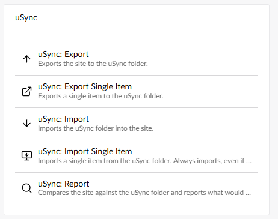
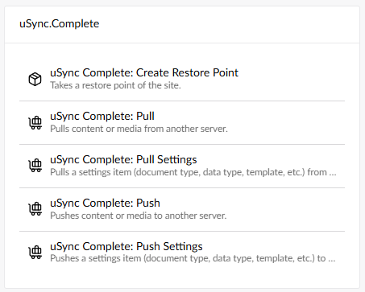

willy wonka eats a conker

uSync.Automate allows you to automatically use uSync processes via Umbraco Automate workspaces. 

## Installing

To install uSync.Automate you will first need to install [Umbraco Automate](https://docs.umbraco.com/umbraco-automate/getting-started/getting-started). Once you have done that, you can install uSync Automate via the commandline. 

```html
dotnet add package uSync.Automate --version 17.0.0-beta1
```

```html
dotnet add package uSync.Automate.Actions --version 17.0.0-beta1
```


## Using uSync.Automate

Once you have everything installed, you can use uSync specific settings in the automation section of the back office. 



The uSync options, like import and export, will work exactly the same [as usual](usync/getStarted/importing). The only difference is the automated process.

## uSync.Complete

If you are using uSync.Complete, you should also install `uSync.Automate.Actions.Complete`.

```html
dotnet add package uSync.Automate.Actions.Complete --version 17.0.0-beta1
```
### Automation for uSync.Complete



uSync.Complete automation gives you the access to the additional tools associated with uSync complete to add to your workspaces.


## Automated Push and Pull [badname]

more using thing

your welcome