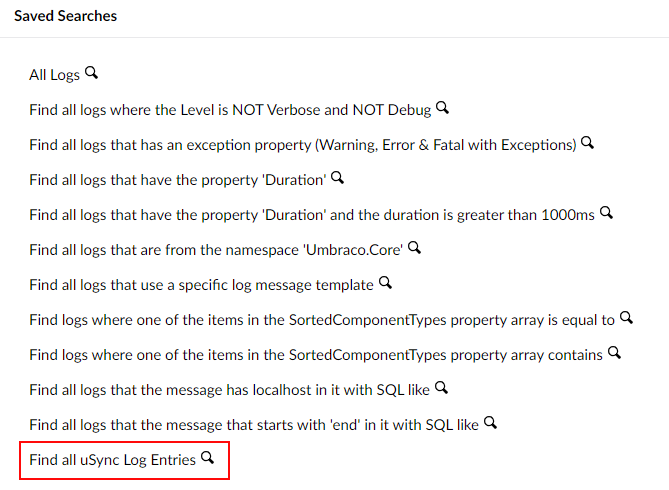

There may come a time when uSync isn't doing what you expect it to do ☹. This is a sad time for us all, we want to stop that from happening, but first we need to work out what is wrong.

The best way to do that is to turn on debug logging and work through what uSync is doing. 

## Turning on Debug Logging

Logging in Umbraco 15 is managed via [Serilog](https://our.umbraco.com/documentation/Fundamentals/Code/Debugging/Logging/) which outputs all logging messages to files in the `App_Data/Logs` folder.

To turn on debug logging, add the following to the `appsettings.json` file. 

```json title="/appsettings.json"
{
    "Serilog" : {
        "MinimumLevel": {
            "Override" :{
                "uSync": "Debug" 
            }
        }
    }
}
```

:::tip 
You will need to restart your site once you have edited this file.
:::

## Viewing the Logs
These logs can be viewed either inside Umbraco, in the settings section under Log Viewer, or externally using the [Compact Log Format Viewer](https://github.com/warrenbuckley/Compact-Log-Format-Viewer).

To view logs in Umbraco go to Settings --> Log Viewer and click on "Find all uSync Log Entries".


Alternatively, the query below will give you all the uSync messages in the log file: 

```cs
StartsWith(SourceContext, 'uSync')
```


## Verbose Logging 
If you are having issues with connections in uSync.Complete, you may need to turn on verbose logging. 

As with debug logging, add a verbose logging line to the `appsettings.json` file. 

```json title="/appsettings.json"
{
    "Serilog" : {
        "MinimumLevel": {
            "Override" :{
                "uSync": "Verbose" 
            }
        }
    }
}
```

----

Happy logging.