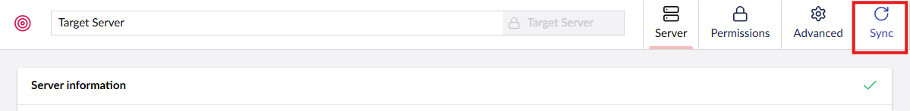
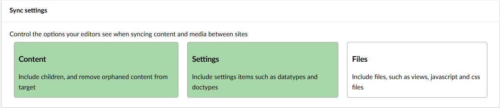

Before you sync content between servers, you will first need to sync your settings. 

If you haven't synced settings between servers via your build process or uSync, you can sync settings via the Sync tab on the server configuration page.

Here, you can choose the elements that will sync.

## Sync Settings with Content

If you want to apply these settings along with the content, go to the sever configuration page and select Settings in the Sync Settings section.

