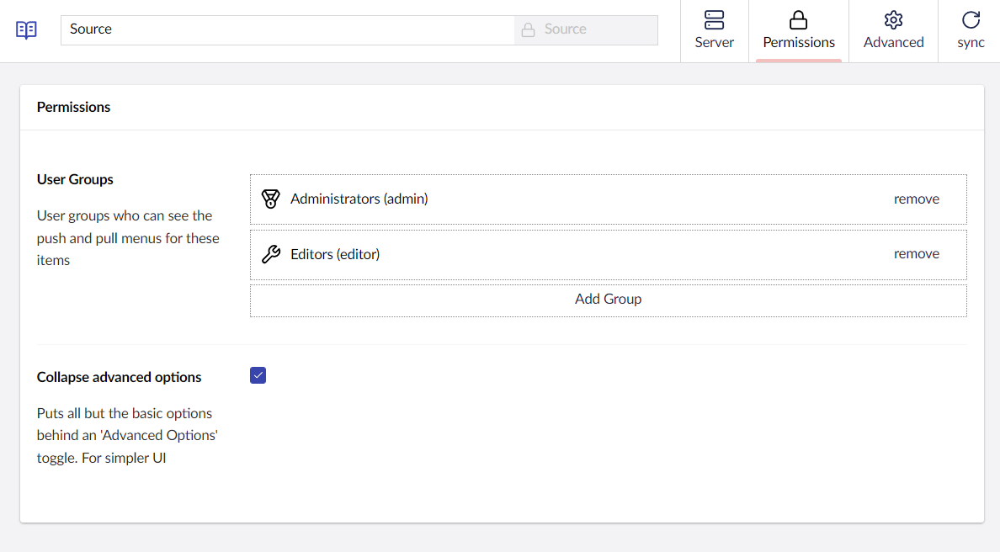
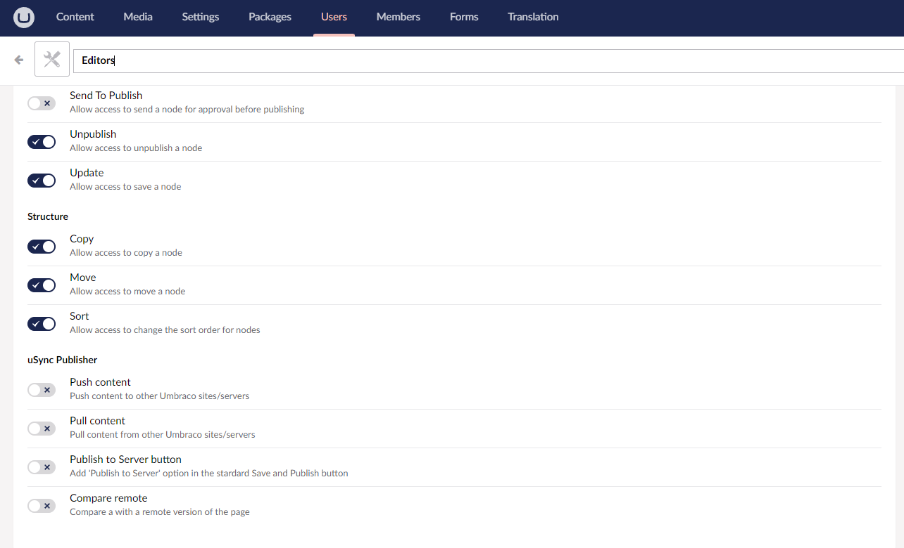

You can choose certain permissions on your server for certain groups. In the backoffice, go to Settings --> uSync Publisher, and click on the server you want to edit permissions for. Select the permissions tab, and adjust the settings to your liking!

## Umbraco Permissions
For groups to access certain uSync Publisher features, you will need to set Umbraco permissions. These permissions can be found by going to Users in the backoffice, selecting the groups tab and clicking on the user group whose permissions you want to edit. 

