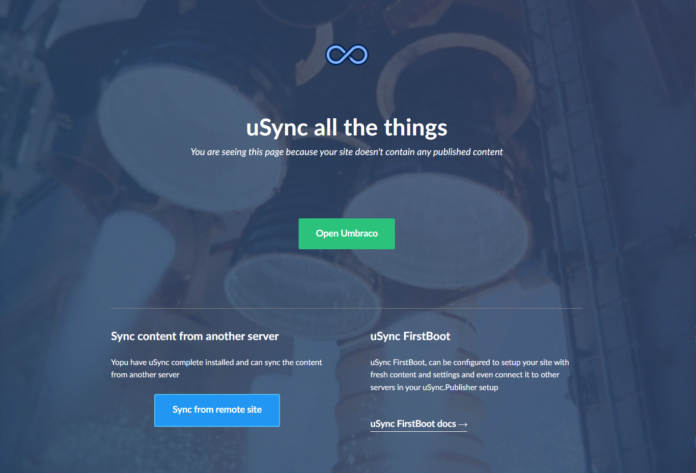
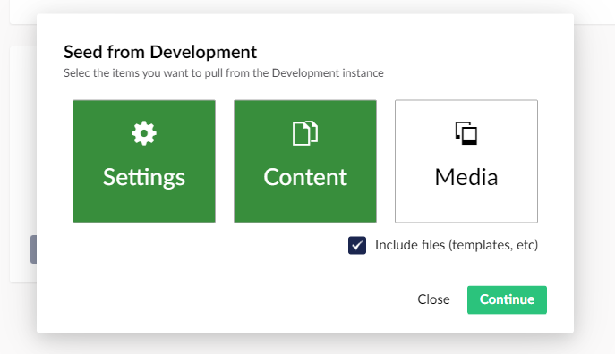

uSync SiteSeed allows you to seed a new site with settings, content, media and files from an existing site.

This means you can build a new site, and with a few clicks get it running just like your live site. 

## Setting Up SiteSeed

SiteSeed requires that you define the URL of your seed server in the `"SeedServerUrl"` value in your `appsettings.json` or `appsettings.development.json` file:

```json title="appsettings.json"
{
  "uSync": {
    "Publisher": {
      "Settings": {
        "IncomingEnabled": true,
        "AppId": "xxxxxxxxxxxxxxxxxx",
        "AppKey": "xxxxxxxxxxxxxxxxxxxxxxxxxxxx",
        "SeedServerUrl": "https://pathtosite.com/umbraco"
      }
    }
  }
}
```

If you startup a site with no published content you will get the uSync.Complete 'nonodes' page: <!-- This page will offer you the option to seed the current site from the defined server: -->



<!--If you select Sync from remote site, you will then be taken into the Umbraco backoffice (this will require you to login) where a popup will offer you the chance to sync the elements of your choosing with your local site.

 --->

## FirstBoot 🥇🥾 & SiteSeed 🌱

SiteSeed can be used in conjunction with [uSync FirstBoot](/usync/uSync/guides/firstboot) where you can automatically import settings and content from the local disk and then use SiteSeed to fetch them. Although at the moment it is not possible to automatically trigger the SiteSeed element of this process as it requires multiple steps and choices to be made between the source and target servers.


