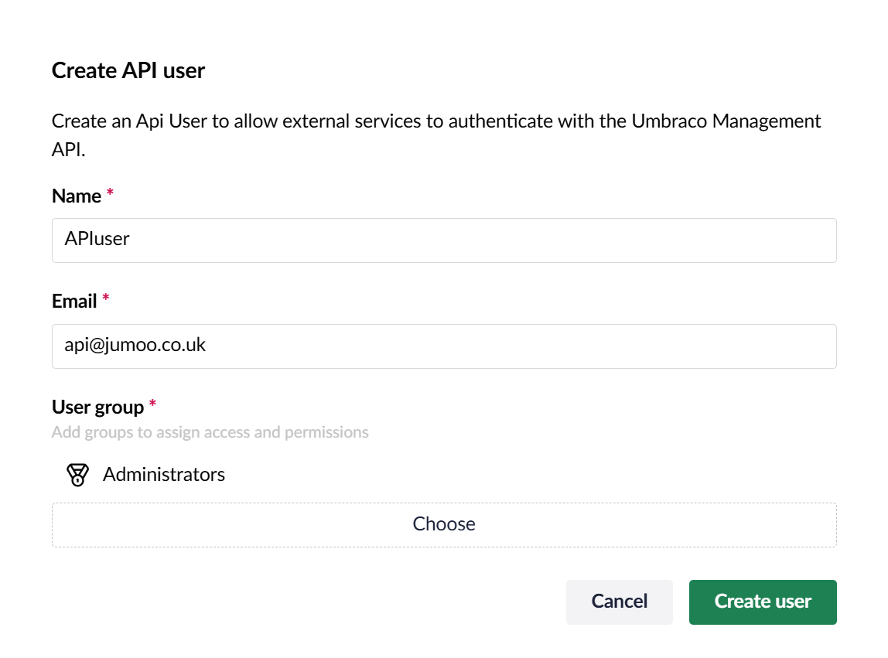

In order to use uSync.CommandLine you have to make an API user. You can do this in the users section of Umbraco.


Create the API user and add them to the relevant group!



## Add a Client Secret and Key

Once you have created an API user, you will need to give them a Client ID and Secret.


You will need both the Client ID and a Secret to connect via the command-line.


:::tip
Umbraco requires the client ID to start with `umbraco-back-office-` to work.
:::

## Add an appsetting.json File

You can add an appsettings.json file to the root of the folder where you are running uSync.CommandLine:

```json
{
  "uSync": {
    "Command": {
      "Secret": "[CLIENT_SECRET]",
      "ClientId": "[CLIENT_ID]"
    }
  }
}
```
## Or Use the -k -i Settings

Alternatively, you can pass these on the CommandLine. eg.

`usynccli usync-ping -s https://localhost:44359 -k [client_secret] -i [client_id]`

Once this is set up, you can use all the [Commands!](Commands)

## uSync.Command.Setup

You can also install the `uSync.Command.Setup` package to set the generate the user and client secret in Umbraco automatically. You can install this package by typing the following command in the command-line.

```
dotnet add package uSync.Command.Setup --version 16.1.0
```

This will allow you to add the `AddIfMissing` setting to the appsettings and fill in user details. 

```json
{
  "uSync": {
    "Command": {
      "AddIfMissing": true,
      "Secret": "[CLIENT_SECRET]",
      "ClientId": "[CLIENT_ID]"
    }
  }
}
```

Then uSync.CommandLine will search for a user with this client ID. If one does not exist it will create the API user and the client ID  for you. 